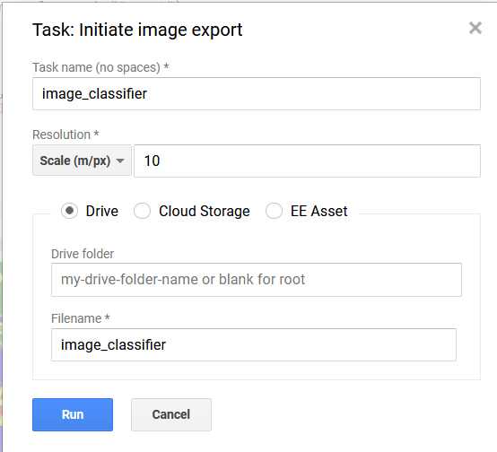

<!--html_preserve--><script>
  addClassKlippyTo("pre.javascript");
  addKlippy('right', 'top', 'auto', '1', 'Click to copy', 'Done');
</script><!--/html_preserve-->


# Résumé
Cet atelier Numérliab a pour objectif d'introduire la plateforme Google Earth Engine (GEE) et certaines de ses fonctionnalités.  

Earth Engine est un logiciel en ligne de la compagnie Google qui met à la disposition de ses utilisateurs une grande variété de données géographiques (images satellitaires, données climatiques, topographiques, etc.), ainsi que des outils pour les analyser. L’avantage de GEE est qu’une grande majorité des calculs sont faits directement par les serveurs de Google sur le cloud, donc beaucoup plus rapidement que sur un ordinateur personnel. Le but de cet atelier n’est pas d'apprendre un nouveau langage de programmation, mais plutôt de présenter certains outils et codes reproductibles et adaptables à vos besoins.

# Objectifs
- Importer et visualiser des images satellites propres à une région et un moment donné;  
- Travailler avec des images satellites pour une région déterminée par un fichier shapefile;  
- Faire un calcul du NDVI;
- Faire une classification d’image satellite;  
- Exporter les couches produites sous forme de raster; 
- Faire des graphiques;

# Étape 1 : Introduction à l'interface EE

Pour accéder aux différentes fonctionnalités de GEE, vous devez premièrement avoir un compte Google. À l’aide de votre identifiant Gmail, vous pourrez vous inscrire au lien suivant. https://signup.earthengine.google.com/#!/
Une fois votre inscription complétée, il vous faudra aller sur l’interface pour faire vos scripts. https://code.earthengine.google.com/ 

Voici quelques informations pour vous retrouver dans l'interface.


**Panneau de gauche**  
-	Bibliothèque où sont enregistrés tous vos codes  
-	Bibliothèque de GEE où sont les exemples de codes et la description des outils GEE  
-	Bibliothèque de vos propres couches (shapefiles, raster et autres bases de données).  

**Panneau du centre**  
- Éditeur de code où vous faites vos calculs  

**Panneau de droite**  
- Onglet d’inspection de la couche pour inspecter les métadonnées de votre carte (informations sur les couches et les pixels)  
- Console des sorties où l’information des différentes cartes ou les graphiques s’affichent  
- Gestionnaire de tâche pour les documents importés ou exportés  

**Barre de recherche**  
- Pour rechercher un lieu ou des couches de données  

**Carte**  
- Carte interactive où sont affichées vos couches calculées par-dessus une carte typique de Google  

# Étape 2 : Sélectionner un lieu d’intérêt à l’aide des outils de géométrie

Naviguer sur la carte jusqu’au Parc National de la Mauricie. Il est aussi possible de faire une recherche à l’aide de la barre de recherche, p. ex. "Shawinigan".  

1.	À l’aide de l’outil de géométrie, « ajouter un repère » en cliquant sur le pictogramme de repère et déposez-le au milieu du Parc national.  
2.	Cliquer sur « exit » une fois que le repère est placé.  
3.	Renommer le nouveau repère « pnm » dans le haut de votre script.  
  


*Alternative*, utiliser la ligne de code suivante. Pour importer le repère, il vous faudrait cliquer sur le bouton importer qui serait proposer après avoir taper ce code. 


```{.javascript .klippy}
var pnm = /* color: #d63000 */ee.Geometry.Point([-72.97, 46.74])

```

**N’oubliez pas d’enregistrer votre code à l’aide du bouton enregistrer.**


# Étape 3 : Charger et afficher une carte de l’élévation

Pour importer une couche, vous devrez la charger à partir de la banque de données de Earth Engine. Pour cela, il suffit de rechercher au sein du catalogue GEE à l’aide de la barre de recherche et de l’importer. À noter que lorsqu’une couche est importée elle ne s’affichera pas directement. Comme aucunes limites n’ont été spécifiées pour cette couche, elle contient l’information reliée à une énorme superficie et le mieux est de la filtrer pour avoir un affichage autour d’un lieu d’intérêt.  Voici un exemple avec des données d’élévation.  
  
-	Pour ajouter la couche d’élévation SRTM, rechercher et sélectionner la couche NASA SRTM Digital Elevation 30m .

-	Vous pouvez consulter l’information disponible pour cette couche dans les différents onglets du panneau qui s’est affiché. Ensuite, cliquez sur importer pour que la couche s’ajoute à votre environnement EE.  


-	Une fois ajoutée, vous pouvez renommer la couche « srtm ». 


- Pour afficher les propriétés de la couche importée utiliser le code suivant et le résultat s’affichera dans le panneau droit.


```{.javascript .klippy}
// Imprimer la couche d'élévation dans la console
print(srtm);
```

- Pour afficher la couche srtm, il suffit d'utiliser la commande « Map.addLayer » qui permet d’ajouter une couche à la carte. Cependant il faut souvent définir des paramètres de visualisation pour améliorer les paramètres par défaut des couches. 


```{.javascript .klippy}
// Ajouter la couche d'élévation
Map.addLayer(srtm);
```


-	Pour afficher plus en détail le relief, il suffit de mettre des valeurs de relief plus près de celle de notre lieu d’intérêt. Il est aussi possible d’ajouter un nom à la couche que vous faites afficher.


```{.javascript .klippy}
// Ajouter la couche d'élévation avec une échelle appropriée
Map.addLayer(srtm, {min: 0, max: 400},"Élévation");
```

-	Pour faciliter la visualisation de l'élévation, il est possible de donner un gradient de couleur aux valeurs d’élévation.


```{.javascript .klippy}
// Ajouter la couche d'élévation avec des paramètres de visualisation adéquat
Map.addLayer(srtm, {min: 0, max: 400, palette: ['blue', 'yellow', 'red']},"Élévation colorée");
```


- L’information sur l’élévation est utile, mais elle peut être complémentée avec d’autres informations comme le relief au sol et les pentes. Les outils ee.Terrain.hillshade() et ee.Terrain.slope() permettent de calculer rapidement ces attributs.


```{.javascript .klippy}
// Calculer une couche de modèle relief ombré 
var ombre = ee.Terrain.hillshade(srtm);

// Visualier la couche de modèle relief ombré
Map.addLayer(ombre, {min: 150, max:255}, 'Ombre');

// Créer une carte des pentes
var pente = ee.Terrain.slope(srtm);

//Afficher la carte des pentes
Map.addLayer(pente, {min: 0, max: 30}, 'Pente')
```


# Étape 4 : Travailler avec des images satellitaires pour une région déterminée

Le catalogue de données de Google Earth Engine permet d'accéder à de nombreuses sources d'images satellitaires. Pour travailler sur d’un lieu d’intérêt, il faudra filtrer les données disponibles pour ce lieu pour une période donnée. Commencez par importer les images du satellite Sentinel 2 (aussi possible pour Landsat).  

- Pour ce faire, rechercher « sentinel » dans la barre de recherche et sélectionner «Sentinel-2 MSI : Multispectral Instrument, Level-1C, l'importer puis renommer l’objet « sent2 ».


- Utiliser le code ci-dessous pour voir le nombre d’images trouvées autour du lieu d’intérêt qu’est le Parc national de la Mauricie entre septembre et octobre 2020, avec une couverture nuageuse moindre. La fonction .size() permet d'afficher dans la console de droite le nombre d'images correspondants à la requête définie.


```{.javascript .klippy}
// Définir la variable d'image satellite
var pnm_s2=sent2
    .filterBounds(pnm) // Filtre géographique
    .filterDate("2020-07-01", "2020-08-30") // Filtre temporel
    .filterMetadata('CLOUDY_PIXEL_PERCENTAGE','less_than',10);// Filtre clarté d'image

// Requête du nombre d'image
print(pnm_s2.size(),"n. images");
                              
```


```{.javascript .klippy}
//Imprimer les propriétés de l'image dans la console
print(pnm_s2, "propriétés pnm_s2")
```
      

-	Le code précédent peut permette d'afficher plusieurs images satellites. La méthode suivante sera celle adoptée pour sélectionner la meilleure image selon les filtres appliquée. 


```{.javascript .klippy}
// Définir l'inage à importer
var pnm_i = sent2
    .filterBounds(pnm) // Filtre géographique
    .filterDate("2020-07-01", "2020-09-30") // Filtre Temporel
    .sort("CLOUD_COVERAGE_ASSESSMENT") // Filre pour la clartée de l'image
    .first(); // Sélection de l'image avec le moins de nuage possible

print(pnm_i,"meilleur image");
      
```


```{.javascript .klippy}
//extra : 2nd best?
var pnm_i2 = sent2
    .filterDate("2020-07-01", "2020-09-30")
    .filterBounds(pnm)
    .sort("CLOUD_COVERAGE_ASSESSMENT")
    .select(1);  //le premier index est 0, donc la 2e image est 1
print(pnm_i2, "2e meilleur image");
      
```

-	Pour afficher l’image satellite, utilisez la fonction « Map.addLayer », cependant il faudra définir d’avance certains paramètres de visualisation. Ces paramètres viseront à afficher les bandes rouge, bleu et verte.


```{.r .klippy}
var couleur_rgb = {
        bands: ["B4", "B3", "B2"],
        min: 0,
        max: 1850
        };

Map.addLayer(pnm_i,couleur_rgb,"Image Sentinel-2");
```

# Étape 5 : Afficher une image satellite selon les contours d’un shapefile

Dans les étapes précédentes, le lieu d’intérêt était le Parc National de la Maurice. Un repère a été placé à un endroit aléatoire dans le Parc. Il est cependant possible de travailler dans Earth Engine avec des superficies prédéterminées, par exemple dans le cas d’un fichier shapefile. Pour ce faire, il vous faudra importer les fichiers shapefiles de votre ordinateur vers Google Earth Engine.  
  
- Aller dans l’onglet « assets » pour voir les couches externes -> New -> Shape files.  


-	Sélectionner les couches .shp; .dbf;.shx;.prj associé à la couche shapefile désirée à partir d’un répertoire sur  votre ordinateur. -> Taper le nom que vous voulez lui donner ex. « PNM_poly » -> Upload


- Pour confirmer que le fichier est importé, consulter le gestionnaire de tâche dans l’onglet « Task » du panneau droit. Une fois le fichier téléchargé, la barre de téléchargement devrait être remplie et si vous actualisez votre répertoire de couche, la couche importée devrait être affichée dans le panneau de gauche. 


- Pour importer la couche shapefile dans votre code, cliquer sur la couche dans le panneau de gauche -> Importer -> renommer la couche « shape_pnm » dans votre code.


- Le code suivant aurait aussi permis de faire cette même opération


```{.javascript .klippy}
 // Ajouter une variable correspondant à un shapefile
var pnm_poly = ee.FeatureCollection('users/XXX/PNM_poly');
```

Une fois le fichier shapefile importé, il est possible d’afficher la photo satellite seulement pour cette superficie avec l’outil «.clip » et le code suivant:


```{.javascript .klippy}
// Afficher l'image satellite autour d'une région sélectionnée
Map.addLayer(pnm_i.clip(shape_pnm),couleur_rgb,"Image Satellite coupée");
```


# Étape 6 : Calculer un indice spectrale (ex: NDVI)

Un autre exercice qui requiert peu de code avec Google Earth Engine est de créer une nouvelle couche de donnée qui contient une bande calculée comme l’indice NDVI (Normalized difference vegetation index).  
  
Ce type d'index est souvent utilisé pour mettre en évidence certains éléments des images. Dans le cas du NDVI, il s'agit d'un ratio entre les réflectances des bandes rouge et proche infra-rouge qui permet de mettre en évidence la présence de végétation au sein d'une image. La formule permettant de calculer l'indice NDVI est la suivante. 

$$NDVI = \frac{NIR-RED}{NIR+RED} $$
Différentes méthodes permettent de créer une telle couche :

1. Utiliser une fonction.  


```{.javascript .klippy}
// Définir la fonction 
var ndvi = function (x) {
  var result=x.normalizedDifference(["B8", "B4"]).rename("NDVI"); 
  return x.addBands(result);
};

// Appliquer la fonction à une image
var ndvi1 = ndvi(pnm_i);

// Afficher le résultat
Map.addLayer(ndvi1, {bands:['NDVI'],min:0,max:1,palette:['red','yellow','green']},"NDVI Méthode1");
```
  
2. Faire un calcul de la différence des bandes dans une expression.  


```{.javascript .klippy}
// Créer l'expression à calculer
var ndvi2 = pnm_i.expression(
     "(NIR - RED) / (NIR + RED)",
    {
      RED: pnm_i.select("B4"),
      NIR: pnm_i.select("B8"),
 }).rename('NDVI'); // Donner un attribut à la bande créée

// Afficher le résultat
Map.addLayer(ndvi2, {min: 0, max: 1,palette:['cyan','green','orange'] }, "NDVI Méthode 2");
```

# Étape 7 : Faire une classification d'image à l'aide de Google Earth Engine

Le prochain exercice vise à introduire à la classification d’image à l’aide de Google Earth Engine. Le code ci-dessous permettra de faire une classification supervisée des différents types de paysages à partir d’image satellite.  À l’aide d’un jeu de données préliminaires où les différents types de paysages sont connus, l’outil cart permet d’extrapoler la classification à une plus grande échelle.  
  
- La première manipulation sera de créer les polygones du jeu de données d’entrainement. Faites attention à ne  pas prendre de trop grosses superficies, sinon il pourrait y avoir une erreur lorsque vous exécuterez le code. À l’aide des outils de géométrie, créez un polygone dans un endroit boisé. Refaites cette manipulation pour des polygones que vous placerez dans une terre agricole, une étendue d’eau et dans un milieu urbain. Ces polygones  s’appelleront  respectivement « foret », « agricole », « eau » et « ville ».


- Ensuite, il faut ajouter une étiquette à chacun des polygones, un peu de la même manière qu’on ajoute des attributs à la table d’attribut dans un shapefile. Ces étiquettes seront utiles lorsqu’on assemblera les polygones dans une même couche. Pour ajouter une étiquette, allez dans les propriétés d’un polygone -> Sélectionnez « FeatureCollection » -> Ajoutez une propriété -> Nommez-la « landcover » et lui donner une valeur de 0 (le chiffre zéro) -> Ok.  Refaites de même avec les autres polygones où vous créerez une propriété nommée « landcover » et avec des valeurs de 1,2 et 3 respectivement. Après cela, chaque polygone devrait être rendu un objet « FeatureCollection ».


-	Pour combiner les polygones ensemble dans une même couche, utilisez le code suivant pour faire cet assemblage et voyez le résultat dans le panneau de droite.


```{.javascript .klippy}
// Regrouper les différents polygones de paysage dans une même couche
var classNames = foret.merge(agricole).merge(eau).merge(ville);

print(classNames);
```


-	Vous êtes maintenant en mesure d’utiliser la couche précédente pour créer un jeu de données d’entrainement pour la classification à plus grande échelle. Le jeu de donnée d’entrainement va calculer quelles sont les valeurs des pixels reliés à chaque polygone pour les différentes bandes spectrales, ici les bandes 2, 3, 4 et 8 (RGB et NIR avec une résolution de 10m). 


```{.javascript .klippy}
var bands = ['B2', 'B3', 'B4', 'B8']; // pour définir les bandes a utiliser

// Faire le jeu de donnée d'entrainement
var training = pnm_i.select(bands).sampleRegions({
  collection: classNames,
  properties: ['landcover'],
  scale: 30
});

print(training, 'data training');
```

-	Vous pouvez maintenant faire le test de votre classification sur l’image satellite complète.


```{.javascript .klippy}
//L’algorithme de classification (ici l'outil .cart mais il y en a d'autres)
var classifier = ee.Classifier.cart().train({
  features: training,
  classProperty: 'landcover',
  inputProperties: bands
});

// Appliquer la classification à l'image satellite "pnm_i" et ajouter la carte
var classification = pnm_i.select(bands).classify(classifier);
Map.addLayer(classification, {min: 0, max: 3, palette: ['green', 'yellow','blue','red']}, 'classification');
```


Le résultat précédent n’est pas parfait. Il serait probablement utile d'ajouter la couche NDVI générée plus tôt dans l'objet ndvi1 qui contient l'image satellite et le NDVI.


```{.javascript .klippy}
// Ajouter d'autres bandes 
var bands2 = ['B2', 'B3', 'B4', 'B8', 'NDVI']; // pour définir les bandes a utiliser

// Le jeu de donnée d'entrainement avec les nouvelles bandes de l'objet ndvi1
var training2 = ndvi1.select(bands2).sampleRegions({
  collection: classNames,
  properties: ['landcover'],
  scale: 30
});


// L'algorithme de classification
var classifier2 = ee.Classifier.cart().train({
  features: training2,
  classProperty: 'landcover',
  inputProperties: bands2
});

// Appliquer la classification à l'objet ndvi1
var classification2 = ndvi1.select(bands2).classify(classifier2);

Map.addLayer(classification2, {min: 0, max: 3, palette: ['green', 'yellow','blue','red']}, 'classification +ndvi');

```

•	Le résultat final pourrait donc ressembler à ça (bien qu'imparfait encore).


# Étape 8 : Exportation vers un fichier raster via Google Drive

Il est possible d’exporter les couches créées dans Google Earth Engine pour continuer de les modifier dans des logiciels SIG. Par exemple, on pourrait vouloir exporter une partie de la classification précédente dans un fichier raster. Comme l’image satellite est relativement volumineuse, vous exporterez seulement une partie de la couche. 

-	Pour définir la région d’exportation, ajoutez un repère que vous nommerez « exporter ».


-	Le code ci-dessous permet de cibler une zone de rayon de 1500 mètres autour du repère. 


```{.javascript .klippy}
// créer une zone d'exportation
var exportation=exporter.buffer(1500);
Map.addLayer(exportation,couleur_rgb,"Export");
```


-	La dernière manipulation vise à décrire les paramètres d’exportation vers googleDrive. 


```{.javascript .klippy}
//Exporter le raster
Export.image.toDrive({
  image: classification,
  description: 'image_classifier',
  scale: 10,
  region: exportation
});

```


-	Pour compléter l’exportation, appuyer sur le bouton « run » dans l’onglet task et ajuster les paramètres d’exportation comme vous le désirez -> Run



# Étape 9 : Faire des graphiques à l'aide de GEE

L’interface de Earth Engine permet de faire rapidement des graphiques par exemple pour voir la distribution des données d’une couche.  Dans les manipulations suivantes, vous reprendrez la couche d’élévation ajusté au contour du parc national de la Mauricie. Ensuite il vous sera possible de construire un histogramme pour voir la distribution de l’élévation dans cette couche.

-	Créer la couche d’élévation pour le Parc National.


```{.javascript .klippy}
// Création d'une couche d'élévation pour la région de la mauricie
var elevation1= srtm.clip(shape_pnm);
print(elevation1,"Élevation 1");

// Validation de la couche d'élévation créée
Map.addLayer(elevation1, {min: 0, max: 400, palette: ['blue', 'yellow', 'red']},"Élévation colorée pnm");
```

-	Pour créer le graphique à partir de la couche précédente, utiliser l’outil ui.Chart.image.histogram() et imprimer le résultat dans la console de droite. D'autres type de graphiques sont possibles, mais dans le cas présent, un histogramme de fréquence pourrait vous informer sur l'élévation dans le Parc National. 


```{.javascript .klippy}
// Création du graphique
var Chart1 = ui.Chart.image.histogram(
    elevation1,shape_pnm,30);
print(Chart1);
```

-	Il est aussi possible de configurer certaines options de visualisation pour améliorer l’allure du graphique. 


```{.javascript .klippy}
// Définir quelques options pour personnaliser le graphique
var options = {
  title: "Histogramme de l'élévation pour le Parc National",
  fontSize: 15,
  hAxis: {title: "Élévation (m)"},
  vAxis: {title: 'Fréquence'},
  series: {
    0: {color: 'magenta'}
  }}; 

// Créer le graphique personnalisé
var Chart2 = ui.Chart.image.histogram(
    elevation1,shape_pnm,30)
    .setSeriesNames(['Hauteur'])
    .setOptions(options);
print(Chart2);
```

Une fois le graphique afficher dans la console, il vous est possible de l’agrandir et d’exporter les données sous forme de table en différents formats.

**Fin du numerilab**


### SUGGESTION: peut-être montrer qu'il est facile de faire le tout en batch pour genre toutes les images d'une année ou d'une série? je crois que c'est là la grosse force de EE
